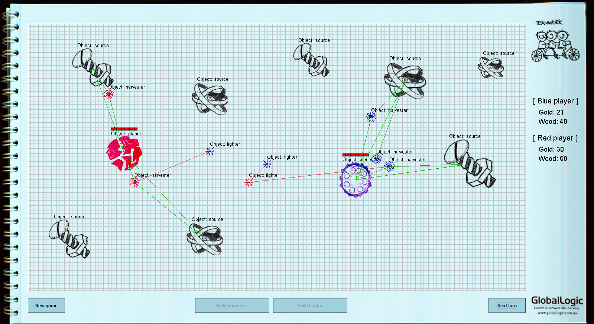

> Originally published on http://heratorz.blogspot.com/2011/08/2011.html

# Хакатон 2011 в Харькове

**6 августа 2011  г.**

Ещё чуть больше недели назад я понятия не имел, что такое [Хакатон](http://www.developers.org.ua/calendar/695/). На [DOU](https://dou.ua) я не слишком частый гость, да и всякие RSS-ленты в последнее время читать абсолютно некогда. Тем не менее, перекинувшись в субботу (30 июля) парой сообщений с [**AquilA**](https://github.com/aquiladev), решили с ним съездить в Ciklum, поглядеть, что да как.

Идеи для проекта у нас, как водится, не было до самого последнего момента. Более того — не было у нас её даже через час после начала мероприятия. Приехав к самому началу Хакатона, мы с ужасом обнаружили, что бесплатная еда будет аж через три с половиной часа! Затянув потуже ремни и жадно сглотнув слюну, мы в поисках хоть какого-то занятия на время томительного ожидания провизии перебрали несколько вариантов проектов, но все они были отброшены по тем или иным причинам. Через 2-2,5 часа подумали, что неплохо было бы написать небольшую игру.

Вскоре после начала обсуждения различных подробностей нашего новорождённого проекта прибыл третий участник команды — **Хератор** [**Skor**](https://github.com/o-skor). Тогда взяв в руки один из блокнотов от бессменного поставщика канцелярских товаров и чашек на подобного рода контестах — компании Global Logic — и заручившись разрешением моей девушки не возвращаться в этот день домой к ужину, мы принялись зарисовывать основные идеи. Так появился концепт космической стратегии.

Однако оставался открытым вопрос: а кто будет создавать дизайн для нашей игры? Решение, как всегда, витало всё это время в воздухе и даже старательно попахивало свежей бумагой и пастой шариковой ручки. Но существо оно гордое, поэтому позволяет себе срываться с уст лишь самого ленивого, но и самого нуждающегося в нём человека. Так и произошло :) Идея родилась внезапно. Кто-то из моих коллег предложил: _а почему бы не сделать игру прямо в блокноте, не мудрствуя лишний раз с дизайном?!_

Не прошло и двух минут, как фотоаппарат, беспрерывно моргая глазком объектива, жадно запоминал всё новые и новые образы блокнота. И тут всем известный пушной зверёк с белой шубкой подкрался не то что бы совсем незаметно, но уж как-то слишком не вовремя — ~~проявителя и закрепителя~~ кабеля от фотоаппарата у нас не было, подходящего кардридера тоже, да и аккумулятор, как оказалось, разрядился к псам :) На выручку пришла народная мудрость «язык до Киева доведёт». Уж не знаю, попал ли AquilA в Киев, но до добрых людей с другим фотоаппаратом язык его таки довёл. Сделали пару-тройку фото, покромсали в фотошопе, Skor набросал костяк проекта… Compile. Run. _…Да, это оно!!!_

Исходя из наших предпочтений выбрали язык программирования: я всем сердцем люблю C++, AquilA предпочитает C#, Skor вообще, не побоюсь этого слова, математик… но в одном наши вкусы сходятся: ~~обойдётся дотнетчик AquilA без своего сишлака~~ _всё равно, на чём писать, лишь бы быстро._ Выбор пал на Java, хотя каких-то недюжинных познаний в этом языке ни за кем из нас доселе не наблюдалось.

Создали mercurial-репозиторий. Распределение ролей: я — рисование в блокноте, последующее фотографирование (на мобилу… на балконе… в потёмках… без вспышки!) и обработка текстур в фотошопе + соответствующий код, а также merge наших правок; AquilA — гейм-дизайн, экономический баланс игры, в частности ресурсы, апгрейды и т.п. + соответствующий код; Skor — проектирование и основная алгоритмическая часть + переиначивание нашего с AquilA кода на свой ~~сумасбродный~~ математический лад.

Обеда мы всё-таки дождались. AquilA съел три банки окрошки, закусил тазиком салата, и работа вновь закипела. С самого начала контеста мы выбрали лучшее место для кодинга во всём офисе — балкон. Когда ноутбуки почти разрядились, добрые охранники Ciklum помогли нам провести на балкон электричество, а когда начало смеркаться даже включили свет. Свежий воздух навевал столько новых и новых идей, что мы со Skor’ом, дабы не лопнуть от их переизбытка, частенько устраивали перекур :) Тот факт, что никуда ходить для этого не нужно было, сэкономил нам немало времени. Кроме того можно было свободно слушать музыку через колонки, никому при этом не мешая.

Ближе к вечеру некоторые команды и соло-разработчики начали понемногу «забивать» на всё это дело. Некоторые из них брали пиво и сидели/спали полночи на балконе, о чём-то тихо общались — благо, балкон большой, никто никому не мешал. Мы же продолжали педалить свою игру, суть которой, собственно, состояла в следующем:

> Есть две фракции (синие и красные), у каждой есть изначально по планете. Планета позволяет строить два типа юнитов: _харвестеры_ для сбора ресурсов и _файтеры_ для уничтожения чужих юнитов и атаки вражеских планет. Кроме этого, файтеры могу получать улучшения защиты и атаки. Помимо этого есть два типа ресурсов, условно названные нами в лучших традициях привычных всем RTS-клише — _Gold_ и _Wood_. Ресурсы используются для покупки юнитов и улучшений. Кроме этого должны быть нейтральные планеты, охраняемые нейтральным AI, которые может захватить любая из фракций. Планеты являются своего рода базами, которые позволяют строить юнитов. **Цель игры:** оставить противника без планет, то бишь без возможности строить новые юниты.

В коде программы всё это вылилось примерно в следующую картину: `WorldEnv` хранит общее состояние игры, в том числе список объектов. Все игровые объекты унаследованы от базового класса `FlyObject`. Планеты, харвестеры, файтеры, ресурсы — потомки этого класса. Метод `makeTurn()` переопределён в некоторых потомках и содержит соответствующую типу юнита логику. Помимо этого мы реализовали относительно простой AI. Об используемых в нашей игре алгоритмах немного позже расскажет Skor.

Провозившись всю ночь с фотографированием и подготовкой в Photoshop текстур, написанием логики поведения AI и бесконечным мёржем наших изменений, мы наконец получили нечто похожее на игру :) Также в процессе написания решили перейти от стратегии реального времени к пошаговому процессу игры, так как он более подходил для демонстрации возможностей. Ещё за неимением времени решили отказаться от апгрейдов файтеров и нейтральных планет. Получилось нечто вот такое:

Потынявшись последние полчаса по офису (а AquilA успел даже вздремнуть на балконной лавке), попытавшись сыграть в настольный теннис (после бессонной ночи координация была на нуле), мы наконец добрались до помещения, в котором должно было проходить голосование.

К этому времени остались самые стойкие команды. У всех были классные проекты, в особенности нам, как и всем остальным, понравился, конечно же, проект команды [**Von Neumann Architecture**](http://von-neumann-architecture.blogspot.com/2011/08/blog-post.html), которые реализовали на Haskell транслятор Pascal-кода в JavaScript и попытались портировать старую игру под DOS. Многие команды подготовили полноценные презентации, запаслись шутками, а некоторые даже подарками. Среди нас же прирождённых шоуменов не нашлось, название нашей команды перекрутили over 9000 раз, и проект свой демонстрировали мы самыми последними, так что рассчитывать ни на что особо не приходилось. Да и не было уже сил :)

Каково же было удивление, когда по результатам общего голосования мы не только вышли в финал наравне с тремя другими проектами (сервис подбора подарков, приложение дополненной реальности и вышеупомянутый транслятор), но и **заняли третье место.** Сервис для подбора подарков, увы, немного не дотянул по количеству голосов, но, уверен, у них ещё всё впереди.

Оставаться на after-party были просто не в состоянии, поэтому совершенно обессиленные мы взяли футболочки на память о мероприятии, под шумок собрали себе по чайному сервизу из халявных чашек GlobalLogic и отправились прямиком к метро, на котором и разъехались по домам, где каждого из нас ждали свои радости (кого лицензионная версия World of WarCraft, а кого и любящая, но изрядно заскучавшая девушка).

Подытоживая, могу отметить, что организация мероприятия была на крайне высоком уровне, за что огромное спасибо организаторам, а также участникам мероприятия. До встречи на следующем харьковском Хакатоне!

P.S. Если кому-то всё ещё интересен наш проект, то исходники можно найти вот здесь: https://github.com/Heratorz/douhack-2011

— [**GooRoo**](https://github.com/GooRoo)
